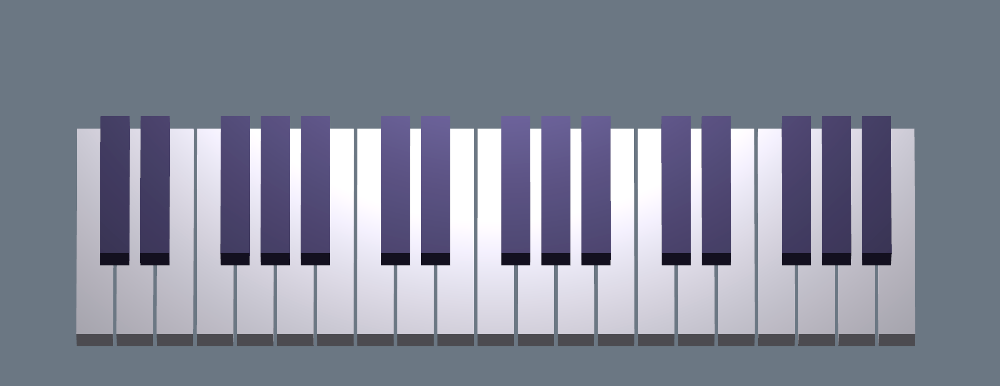

# Audio Station

A toy digital audio station for Mac.

The project consists of two parts:
- a library for generating and playing sounds
- a DAW-like app that uses the library (coming soon)


### The audio library

Built on top of Core Audio, the audio library can generate audio signals and play them in real-time. For better or for worse the library has been implemented in C++. There is a C api available as well so that it can be easily used from any Swift of Objective-C app on Mac.

You can even try the library directly from terminal. Here is an example of doing so:
```cpp
std::vector<AudioSignal> signals {
    { .waveform = Waveform::Sine, .frequency = Frequency::C2, .amplitude = 0.4, .live = true },
    { .waveform = Waveform::Sine, .frequency = Frequency::C4, .amplitude = 0.3, .live = true },
    { .waveform = Waveform::Sine, .frequency = Frequency::F4, .amplitude = 0.2, .live = true },
    { .waveform = Waveform::Square, .frequency = Frequency::C5, .amplitude = 0.01, .live = true },
};

AudioStation station;
station.init();
station.add_signals(signals);
station.play();
std::this_thread::sleep_for(std::chrono::seconds(3));
station.stop();
```

To run the above example:
```bash
cd Audio
make build
make run
```


### The app



The app uses SceneKit for the graphics and the audio library to play some silly sounds. Very much a work in progress.


### Documentation

Audio:
- [Wiki > DAW](https://en.wikipedia.org/wiki/Digital_audio_workstation)
- [Wiki > Waveform](https://en.wikipedia.org/wiki/Waveform)
- [Apple > Audio](https://developer.apple.com/audio/)
- [Apple > Core Audio](https://developer.apple.com/library/archive/documentation/MusicAudio/Conceptual/CoreAudioOverview)
- [Wiki > Piano key frequencies](https://en.wikipedia.org/wiki/Piano_key_frequencies)

Graphics:
- [Apple > SceneKit](https://developer.apple.com/documentation/scenekit)


### Footnote

_Educational purpose only, no guarantees, no promises. Not connected to my employer._
